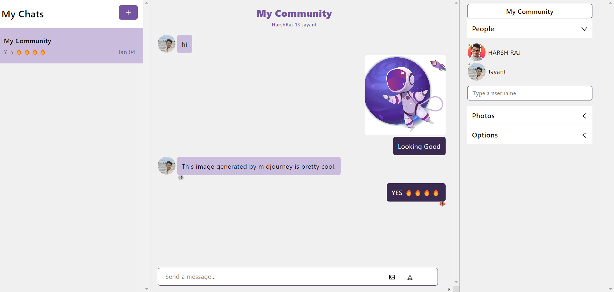

  
  <h1>Chat-Application</h1>

## 📋 <a name="table">Table of Contents</a>
1. 🤖 [Introduction](#introduction)
2. ⚙️ [Tech Stack](#tech-stack)
3. 🔋 [Features](#features)

## <a name="introduction">🤖 Introduction</a>
 Chat Application enabling users to send messages in real-time while displaying each user's online status.

## <a name="tech-stack">⚙️ Tech Stack</a>
- React.js
- Chat Engine API
- CSS

## <a name="features">🔋 Features</a>
👉 **Real-time Messaging** : Users can send and receive messages instantly.

👉 **Online Status** : Indicates whether users are currently active or offline.

👉 **Multi-User Chat** : Multiple users can engage in conversations simultaneously.
